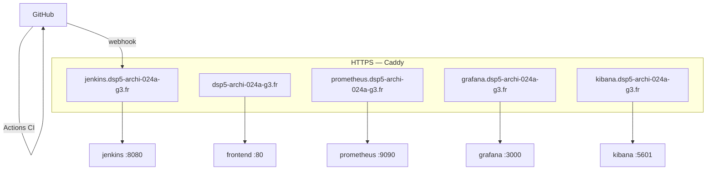

# Thé Tip Top — Jeu-concours

[](https://github.com/HilmiKeles/projet-fin-annee/actions/workflows/ci.yml)
[](https://github.com/HilmiKeles/projet-fin-annee/actions/workflows/sous-domaines.yml)

> Projet étudiant fictif — DSP5 Archi Web, agence Furious Ducks.
> Aucun achat réel ni réservation ne peut être effectué sur ce site.

Application web du jeu-concours Thé Tip Top : les clients participent via un
code ticket obtenu en boutique et remportent des lots (thés, coffrets…).

## Démonstration publique — CI/CD et sous-domaines

Le workflow n'est pas limité au VPS. Il est **visible sur GitHub** :

- pipeline de contrôles : onglet
  [Actions / CI](https://github.com/HilmiKeles/projet-fin-annee/actions/workflows/ci.yml)
- disponibilité des sous-domaines : onglet
  [Actions / Sous-domaines publics](https://github.com/HilmiKeles/projet-fin-annee/actions/workflows/sous-domaines.yml)
- pipeline de production versionné : [`Jenkinsfile`](Jenkinsfile)
- détail : [`docs/ci-cd.md`](docs/ci-cd.md)

| Service | Sous-domaine public |
| --- | --- |
| Site (jeu-concours) | https://dsp5-archi-024a-g3.fr/ |
| Jenkins (CI/CD) | https://jenkins.dsp5-archi-024a-g3.fr/ |
| Prometheus | https://prometheus.dsp5-archi-024a-g3.fr/ |
| Grafana | https://grafana.dsp5-archi-024a-g3.fr/ |
| Kibana | https://kibana.dsp5-archi-024a-g3.fr/ |

Caddy reverse-proxifie chaque service (`Caddyfile`) : le port 8080 de Jenkins
n'est pas publié sur l'hôte.



## Fonctionnalités

- Inscription / connexion / profil utilisateur
- Participation au jeu via code ticket
- Visualisation des gains et des lots
- Back-office administrateur : statistiques, KPI, export emailing —
  [promouvoir un compte en admin](docs/compte-admin.md)
- Espace employé boutique : liste des gagnants et remise des lots —
  [promouvoir un compte en employé](docs/compte-employe.md)
- Responsive (mobile / tablette / desktop), accessibilité et RGPD

## Stack technique

| Couche | Technologie |
| --- | --- |
| Frontend | React, Vite, Nginx |
| Backend | Node.js, Express, Prisma |
| BDD | PostgreSQL 16 |
| Reverse proxy / TLS | Caddy (Let's Encrypt) |
| Conteneurisation | Docker / Docker Compose |
| CI/CD | Jenkins (`Jenkinsfile`) + GitHub Actions |
| Monitoring | Prometheus, Grafana, cAdvisor, Node Exporter |
| Logs | Elasticsearch + Kibana |

## Structure du projet

```text
├── frontend/                 # WebApp React (Docker + Nginx)
├── backend/                  # API Express + Prisma (Docker)
├── jenkins/                  # Image Jenkins LTS
├── monitoring/               # Configuration Prometheus
├── docs/                     # Guides (admin, employé, CI/CD)
├── .github/workflows/        # CI publique + sondes sous-domaines
├── Jenkinsfile               # Pipeline de production
├── Caddyfile                 # Sous-domaines HTTPS
└── docker-compose.yml
```

## Installation et lancement

### Prérequis

- Docker et Docker Compose

### Lancement

```bash
cp .env.example .env   # renseigner les variables
docker compose up -d --build
```

- Frontend (via Caddy) : http://localhost
- API : http://localhost:4000
- BDD : localhost:5432

### Variables d'environnement

| Variable | Description |
| --- | --- |
| `DB_PASSWORD` | Mot de passe PostgreSQL |
| `JWT_SECRET` | Clé secrète JWT |
| `SITE_ADDRESS` | Domaine public (production) |
| `ACME_EMAIL` | Email Let's Encrypt |

## Équipe

| Membre | Rôle |
| --- | --- |
| | Chef de projet |
| | Développeur front |
| | Développeur back |
| | DevOps |

## Mentions légales

Projet étudiant fictif — Thé Tip Top est une marque fictive.
Aucune transaction réelle ne peut être effectuée.
