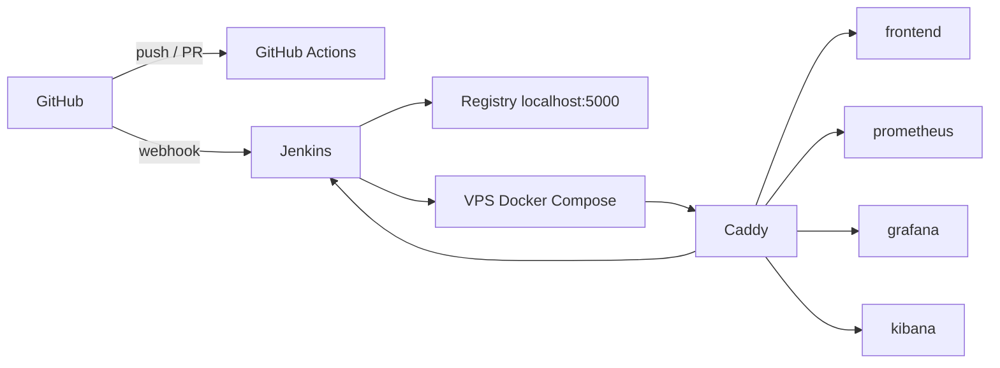

# CI/CD et sous-domaines publics

Le pipeline de production tourne sur **Jenkins**. Les mêmes contrôles
(lint, tests, build, images Docker) sont aussi exécutés sur
**GitHub Actions**, pour que le workflow soit visible sans accès au VPS.

## URLs publiques

Tous les services sont exposés par Caddy en HTTPS (Let's Encrypt),
chacun sur son sous-domaine :

| Service | Rôle | URL |
| --- | --- | --- |
| Site | Frontend React (Nginx) | https://dsp5-archi-024a-g3.fr/ |
| Jenkins | CI/CD production, webhook GitHub | https://jenkins.dsp5-archi-024a-g3.fr/ |
| Prometheus | Métriques | https://prometheus.dsp5-archi-024a-g3.fr/ |
| Grafana | Tableaux de bord | https://grafana.dsp5-archi-024a-g3.fr/ |
| Kibana | Logs (ELK) | https://kibana.dsp5-archi-024a-g3.fr/ |

La sonde GitHub Actions (workflow **Sous-domaines publics**) interroge
ces URL à chaque push et toutes les 6 heures.

## Flux

1. Un push sur GitHub déclenche **GitHub Actions** (démonstration publique)
   et le **webhook Jenkins** (`https://jenkins.dsp5-archi-024a-g3.fr/github-webhook/`).
2. Jenkins exécute le `Jenkinsfile` versionné à la racine :
   checkout → lint → tests → build frontend → images Docker → push registry.
3. Caddy termine le TLS et reverse-proxifie chaque service sur son
   sous-domaine (`Caddyfile`).

## Fichiers

| Fichier | Rôle |
| --- | --- |
| `Jenkinsfile` | Pipeline déclaratif production |
| `.github/workflows/ci.yml` | CI publique (lint, tests, build, images) |
| `.github/workflows/sous-domaines.yml` | Sondes HTTPS des sous-domaines |
| `Caddyfile` | Routage `jenkins.`, `prometheus.`, `grafana.`, `kibana.` |
| `docker-compose.yml` | Stack complète (app + CI + monitoring + logs) |
| `jenkins/` | Image Jenkins LTS + Docker CLI |

## Configuration Jenkins

1. Job **Pipeline** (ou Multibranch) lié à
   `https://github.com/HilmiKeles/projet-fin-annee`
2. Script Path : `Jenkinsfile`
3. Webhook GitHub : `https://jenkins.dsp5-archi-024a-g3.fr/github-webhook/`

Le détail opérationnel (mot de passe initial, socket Docker) est dans
[`jenkins/README.md`](../jenkins/README.md).
